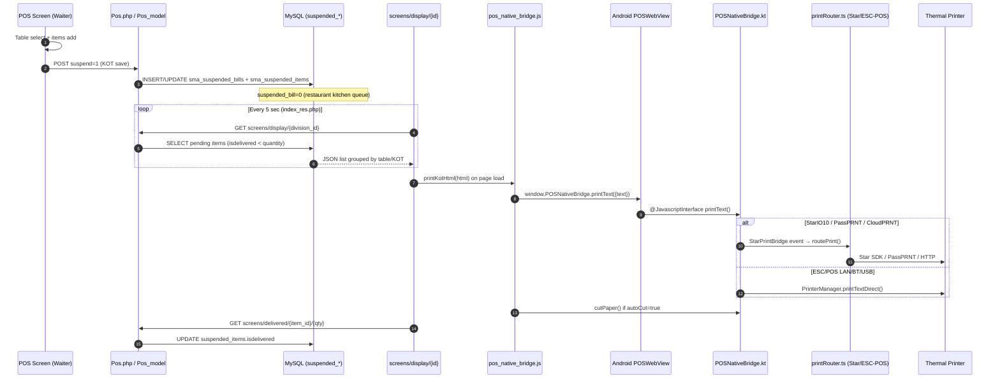
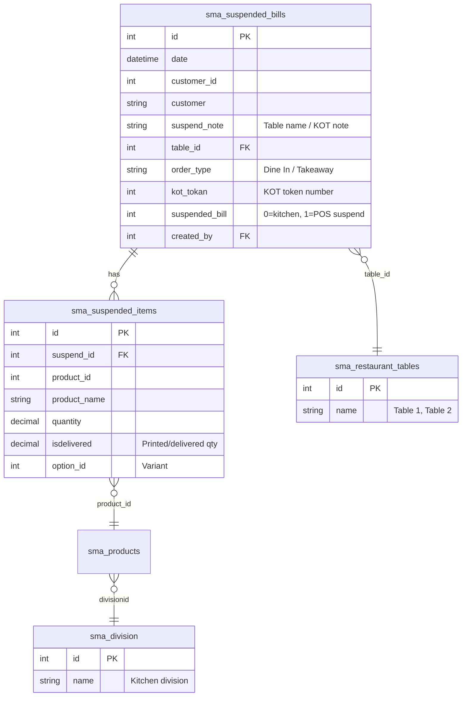
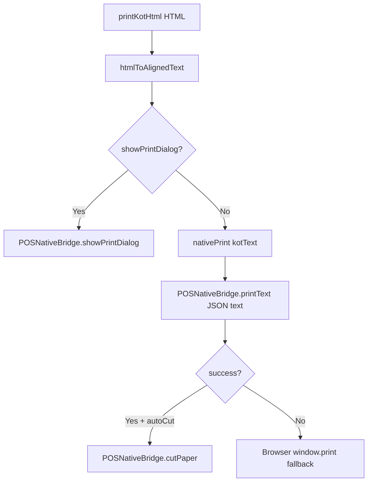
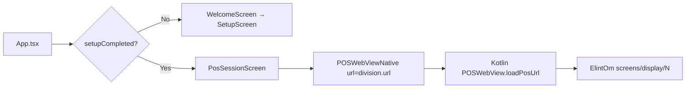
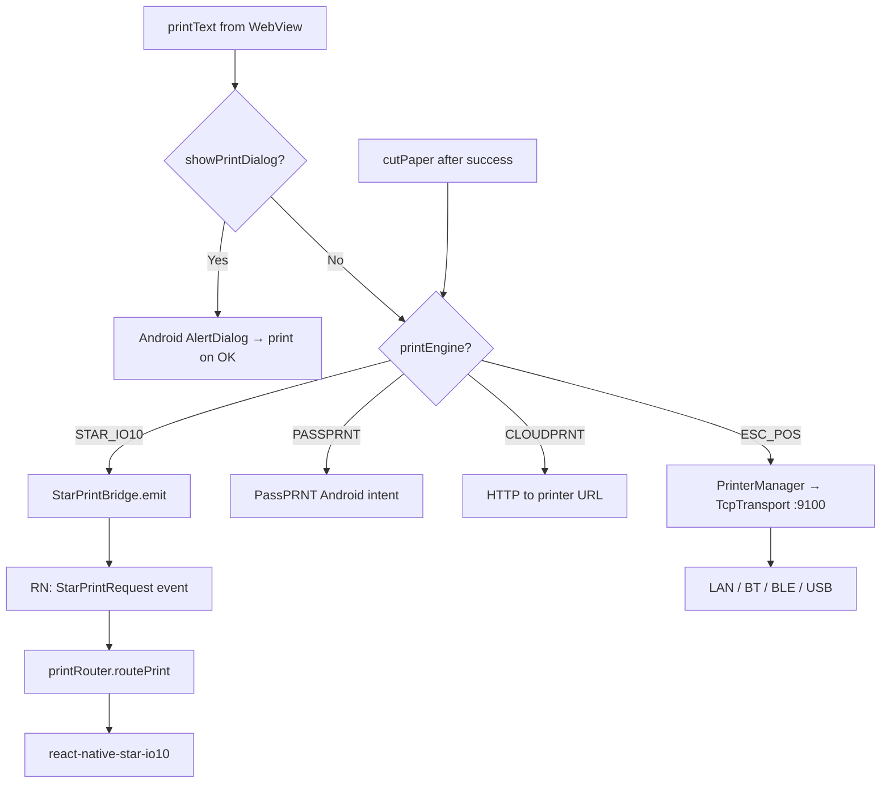

# Restaurant KOT → Kitchen Display → Android Print — Full Architecture

**Systems:** ElintOm (PHP/MySQL) + Android Kitchen Printer (React Native + Kotlin)  
**Use case:** `pos_type = restaurant` — waiter POS वर table select, items add, KOT save → kitchen screen वर record → thermal printer print

---

## 1. End-to-end flow (one picture)



---

## 2. Phase A — Restaurant POS (ElintOm server)

### 2.1 User actions on POS

| Step | User action | What happens |
|------|-------------|--------------|
| 1 | Open POS (`pos_type = restaurant`) | Table layout / KOT mode |
| 2 | Click **KOT** / select **table** | `table_id`, `suspend_note` (table name) set |
| 3 | Add menu items | Cart in browser session |
| 4 | **Save / Suspend** (KOT send) | Form POST with `suspend=1` |

**Key controller:** `ElintOm/app/controllers/Pos.php`  
**Key model:** `ElintOm/app/models/Pos_model.php` → `suspendSale()`

### 2.2 Save logic (restaurant vs other POS)

When `$suspend === true` in `Pos.php`:

```php
// Pos.php ~1257-1262
if ($this->Settings->pos_type == 'restaurant') {
    $suspend_data['suspended_bill'] = 0;   // kitchen display queue
} else {
    $suspend_data['suspended_bill'] = 1;   // normal suspended bill (not kitchen)
}
$suspend_data['order_type'] = 'Dine In';
$this->pos_model->suspendSale($suspend_data, $suspend_products, $did);
```

| `suspended_bill` | Meaning |
|------------------|---------|
| `0` | Kitchen printer display screen साठी — `screens/display/*` हे records दाखवते |
| `1` | Regular POS suspended bill — kitchen screen वर नाही |

**Redirect after save (restaurant):** `pos/kot` (table view) किंवा `pos`

### 2.3 Alternative paths to same DB

| Trigger | Function | When |
|---------|----------|------|
| KOT suspend (table) | `Pos_model::suspendSale()` | Waiter sends KOT before payment |
| Completed sale + token printer | `Pos_model::AddSuspendDataforKitchen_printer()` | `token_printer = 1` on sale |
| Takeaway/Delivery sale | `Sma::saveSuspendDataForKitchenPrinter()` | Non–Dine In restaurant orders |

---

## 3. Phase B — Database tables

### 3.1 Core kitchen queue tables



### 3.2 Supporting tables

| Table | Role |
|-------|------|
| `sma_kot_log` | Daily KOT token counter per category (`tokan`, `kot_date`, `category_id`) |
| `sma_printer_bill` | KOT print layout settings (font sizes, show category, combo items) |
| `sma_settings` | `pos_type`, `default_printer`, `mother_kitchen`, `display_token` |
| `sma_pos_settings` | `token_printer`, `display_category`, counter settings |

### 3.3 Important columns for kitchen filter

`Screen_model::getAllSuspendedBills()` query conditions:

- `sb.date >= DATE_SUB(CURDATE(), INTERVAL 1 DAY)` — last ~24 hours
- `p.divisionid IN (division_id)` — only this kitchen division's products
- `sbi.isdelivered != sbi.quantity` — only **pending** (not yet printed/delivered) qty
- Restaurant mode: **no `created_by` filter** — all tables' KOTs visible to kitchen

---

## 4. Phase C — Kitchen display screen (ElintOm web)

### 4.1 URL & setup

Android app Setup wizard मध्ये Division URL:

```
https://{server}/ElintOm/screens/display/{division_id}
```

Example: `screens/display/1` → division id `1` चे products kitchen ला दिसतात.

### 4.2 Controller flow

**File:** `ElintOm/app/controllers/Screens.php`

```php
function display($id) {
    $this->data['division'] = $this->Screen_model->find($id);  // sma_division
    // restaurant: show ALL users' KOTs
    if (in_array($this->data['Settings']->pos_type, ['restaurant', 'bakery'])) {
        $this->data['user_group_id'] = 'all';
    }
    $this->data['list'] = $this->Screen_model->getAllSuspendedBills($this->data);
    // Group by suspend_note (table name)
    foreach ($list as $val) {
        $data_json['group_items'][$val->suspend_note][] = $val;
    }
    // Restaurant view
    if ($this->data['Settings']->pos_type == 'restaurant') {
        $this->page_construct('screens/index_res', ...);
    }
}
```

### 4.3 Auto-refresh (polling — not WebSocket)

**File:** `ElintOm/themes/default/views/screens/index_res.php`

```javascript
// Page reload every 5 seconds
window.setTimeout(function(){ window.location.href=window.location.href }, 5000);
```

| Mechanism | Detail |
|-----------|--------|
| Polling | Full page reload every **5 sec** |
| WebSocket | **Not used** |
| AJAX | Print success नंतर `screens/delivered/{id}/{qty}` per item |

### 4.4 When new KOT appears

1. POS saves → `sma_suspended_bills` + `sma_suspended_items`
2. Kitchen tablet next refresh (≤5 sec) → `Screens::display()` → SQL returns new rows
3. If `count($list) > 0` → auto-print script runs

### 4.5 KOT HTML generation & print trigger

**File:** `index_res.php` (bottom script)

```javascript
// Android device only — load bridge
<script src="pos/js/pos_native_bridge.js"></script>

// On page load when items exist:
var print_content = get_print_html(data_json);  // builds KOT slip HTML per table

window.posNativeBridge.printKotHtml(print_content, function(ok) {
    if (ok) {
        // Mark each item delivered (printed)
        $.get(base_url + 'screens/delivered/' + suspend_id + '/' + item_quantity);
    }
});
```

**`get_print_html()`** builds per-table KOT slip:
- Site name, KOT token, customer, date/time
- Order type (Dine In)
- Table name (`suspend_note` key)
- Items grouped by category with qty `(quantity - isdelivered)`

---

## 5. Phase D — JavaScript bridge (ElintOm → Native)

### 5.1 Bridge file

**File:** `ElintOm/themes/default/assets/pos/js/pos_native_bridge.js`



### 5.2 Key functions

| Function | Role |
|----------|------|
| `getPrinterSettings()` | Calls native `getPrinterSettings()` — CPL, autoCut, showPrintDialog |
| `printKotHtml(html, cb)` | Main kitchen entry — HTML → aligned plain text → print |
| `tryPosConnectPrint(text)` | `POSNativeBridge.printText(JSON.stringify({text}))` |
| `waitForBridge()` | Polls up to 2 sec for native bridge (Android inject delay) |

### 5.3 Print settings source

Kitchen JS reads settings from **Android native config** (Setup screen वर save):

```javascript
// pos_native_bridge.js
getPrinterSettings() → POSNativeBridge.getPrinterSettings()
// Returns: showPrintDialog, autoCut, cutMode, charactersPerLine, width
```

---

## 6. Phase E — Android app load path

### 6.1 App startup



| File | Role |
|------|------|
| `src/App.tsx` | Navigation, `loadConfig()`, `startStarPrintListener()` |
| `src/screens/PosSessionScreen.tsx` | Toolbar + WebView with `config.division.url` |
| `src/components/POSWebViewNative.tsx` | RN wrapper → native `POSWebView` |
| `android/.../POSWebView.kt` | WebView + bridge attach |
| `android/.../POSWebViewManager.kt` | RN view manager |

### 6.2 WebView initialization

**File:** `android/app/src/main/java/com/posconnectrn/POSWebView.kt`

On page load complete:

```kotlin
override fun onPageFinished(view: WebView?, url: String?) {
    attachBridgeIfNeeded()                              // Add POSNativeBridge interface
    view?.evaluateJavascript(PosNativeJs.WRAPPER, null) // window.POSNative async wrapper
    view?.evaluateJavascript(PosNativeJs.PRINT_HOOK, null)
}
```

`attachBridgeIfNeeded()`:

```kotlin
addJavascriptInterface(bridge, "POSNativeBridge")  // PosNativeJs.INTERFACE_NAME
```

ElintOm page मधील `pos_native_bridge.js` आता `window.POSNativeBridge.printText()` call करू शकते.

### 6.3 Metro bundler (debug)

React Native JS (screens) Metro वरूn load होते (`npm run android:studio`).  
ElintOm kitchen page WebView मध्ये **server वरूn** load होते — हे separate आहे.

---

## 7. Phase F — Native bridge → Printer

### 7.1 Kotlin entry: `printText`

**File:** `android/app/src/main/java/com/posconnect/bridge/POSNativeBridge.kt`

```kotlin
@JavascriptInterface
fun printText(textDataJsonStr: String): String {
    val printer = configRepo.configState.value.printer

    if (printer.showPrintDialog) {
        return showPrintDialogInternal(...)  // User confirm dialog
    }

    if (StarPrintBridge.usesStarJsEngine(printer)) {
        // Queue to React Native Star router
        val jobId = StarPrintBridge.emit("printText", printer, text)
        return success("QUEUED", jobId)
    }

    // ESC/POS direct
    return printerManager.printTextDirect(text, isBold)
}
```

### 7.2 Print engine routing



| Engine | Android path | File |
|--------|--------------|------|
| `ESC_POS` | Kotlin `PrinterManager` → `TcpTransport` / `BluetoothTransport` | `com/posconnect/printer/` |
| `STAR_IO10` | Kotlin emit → RN `handleStarPrintEvent` → `starSdk.ts` | `src/printer/starSdk.ts` |
| `PASSPRNT` | RN `passPrnt.ts` | Star PassPRNT app intent |
| `CLOUDPRNT` | RN `cloudPrnt.ts` | HTTP POST to printer |

### 7.3 Star async path (important)

Star engines **sync print in WebView thread करत नाहीत**:

1. `POSNativeBridge.printText` → `StarPrintBridge.emit()` → returns `{status: "QUEUED", jobId}`
2. RN listener: `src/native/posConnect.ts` → `startStarPrintListener()`
3. `handleStarPrintEvent()` → `routePrint()` → Star SDK
4. Result: `notifyPrintResult(jobId, success)` → Kotlin `StarPrintBridge.notifyResult`
5. WebView JS: `posNativeBridge._printResult(ok)` (if callback registered)

### 7.4 Printer settings (Setup → print behaviour)

Saved in Android `SharedPreferences` via `ConfigurationRepository`:

| Setting | Setup UI | Kitchen effect |
|---------|----------|----------------|
| `showPrintDialog` | Off = Auto print | `false` → direct print; `true` → confirm dialog |
| `autoCut` | On/Off | `cutPaper()` after successful print |
| `cutMode` | partial / full | Star/ESC-POS cut command |
| `width` | 3" / 4" | `charactersPerLine` 48 or 64 in KOT text layout |
| `printEngine` | STAR_IO10 / ESC_POS / … | Which routing path |
| `ip` / `starIdentifier` | Printer address | Connection target |
| `connection` | LAN / BT / USB | Transport selection |

**Kotlin exposes to WebView:**

```kotlin
// POSNativeBridge.getPrinterSettings()
put("showPrintDialog", printer.showPrintDialog)
put("autoCut", printer.autoCut)
put("charactersPerLine", printer.width.defaultCpl)
```

---

## 8. Phase G — Mark as printed (DB update)

After successful native print, `index_res.php` calls:

```
GET /screens/delivered/{suspended_item_id}/{quantity}
```

**File:** `Screens.php` → `Screen_model::delivered()`

```php
UPDATE sma_suspended_items SET isdelivered = {quantity} WHERE id = {id}
```

Next refresh: `isdelivered == quantity` → item **kitchen list मधून गायब** (already printed).

Checkbox "Ready" on screen also triggers same endpoint manually.

---

## 9. Complete file map

### ElintOm (server)

| Path | Role |
|------|------|
| `app/controllers/Pos.php` | KOT suspend save, sale, redirect |
| `app/models/Pos_model.php` | `suspendSale()`, `AddSuspendDataforKitchen_printer()` |
| `app/controllers/Screens.php` | `display()`, `delivered()`, `kot()` |
| `app/models/Screen_model.php` | SQL for kitchen queue |
| `app/libraries/Sma.php` | `saveSuspendDataForKitchenPrinter()` |
| `themes/default/views/screens/index_res.php` | Restaurant kitchen UI + auto-print |
| `themes/default/assets/pos/js/pos_native_bridge.js` | Native print bridge |

### Android Kitchen Printer

| Path | Role |
|------|------|
| `src/screens/PosSessionScreen.tsx` | WebView host |
| `src/components/POSWebViewNative.tsx` | RN native view |
| `src/native/posConnect.ts` | Config + Star event listener |
| `src/printer/printRouter.ts` | Engine routing |
| `android/.../POSWebView.kt` | WebView + JS inject |
| `android/.../POSNativeBridge.kt` | `@JavascriptInterface` print API |
| `android/.../PrinterManager.kt` | ESC/POS print engine |
| `android/.../ConfigurationRepository.kt` | Printer settings storage |
| `android/.../StarPrintBridge.kt` | Star → RN events |

---

## 10. Timing diagram (typical Dine In KOT)

```
T+0s    Waiter: Table 5, 2x Pizza, click KOT Save
T+0.1s  MySQL: INSERT suspended_bills (table_id=5, suspended_bill=0)
                 INSERT suspended_items (qty=2, isdelivered=0)
T+0.2s  POS redirects to pos/kot (table view)

T+0–5s  Kitchen tablet polling (last refresh was X sec ago)
T+5s    GET screens/display/1 → SQL returns Table 5 items
T+5.1s  index_res.php: get_print_html() → printKotHtml()
T+5.2s  POSNativeBridge.printText("KOT slip text...")
T+5.3s  Printer prints (ESC/POS or Star)
T+5.4s  cutPaper() if autoCut
T+5.5s  GET screens/delivered/{item_id}/2 → isdelivered=2
T+10s   Next refresh → Table 5 item gone from queue
```

---

## 11. Troubleshooting

| Symptom | Likely cause |
|---------|--------------|
| Red screen "Unable to load script" | Metro not running — `npm run android:studio` |
| Kitchen page loads, no print | `pos_native_bridge.js` not loaded (non-Android UA) or bridge not injected |
| Print works but items repeat | `delivered/` API failed — check network to ElintOm server |
| No KOT on kitchen screen | Wrong `division_id` in URL; product `divisionid` mismatch |
| Wrong paper width | Setup `width` 3"/4" → `charactersPerLine` |
| Star printer queued but no output | `startStarPrintListener()` not active; check Star identifier |
| Dine In items never delete from DB | By design — only `isdelivered` updated, bill stays until POS checkout |

---

## 12. Related docs

- [ANDROID_APP_STRUCTURE.md](./ANDROID_APP_STRUCTURE.md) — folder/file reference
- [README.md](../README.md) — install & run
- ElintOm bridge source: `ElintOm/themes/default/assets/pos/js/pos_native_bridge.js`
